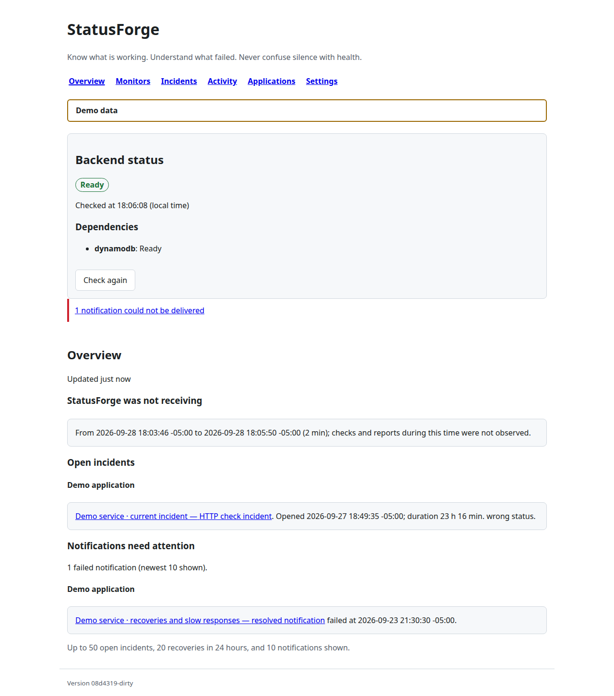
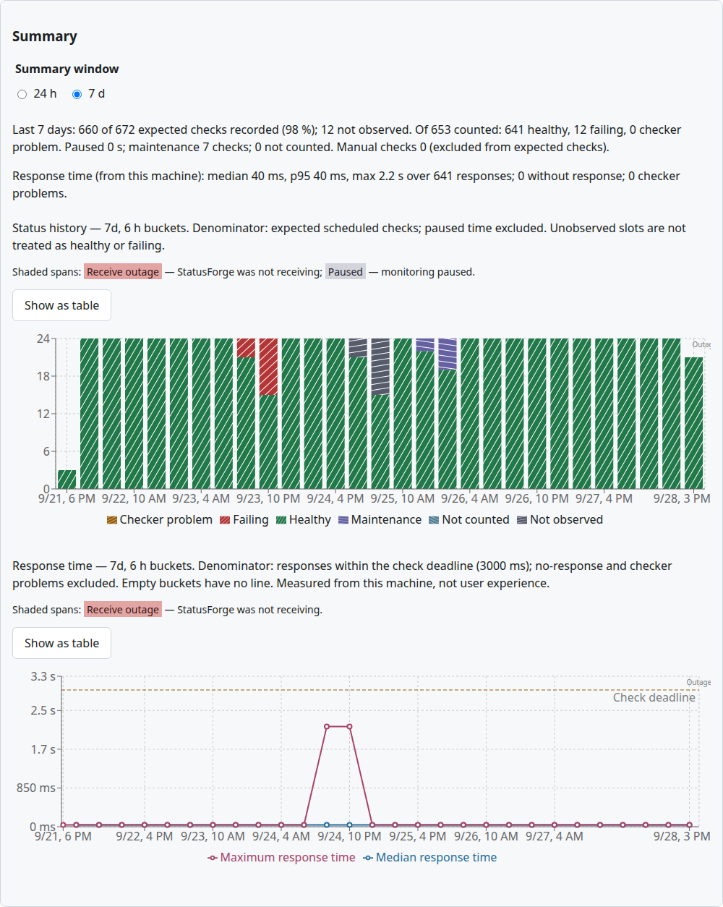
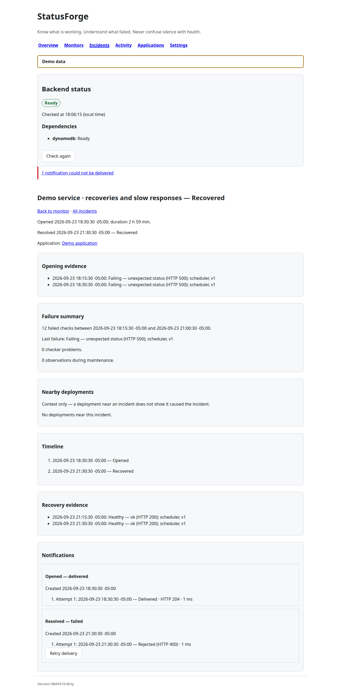
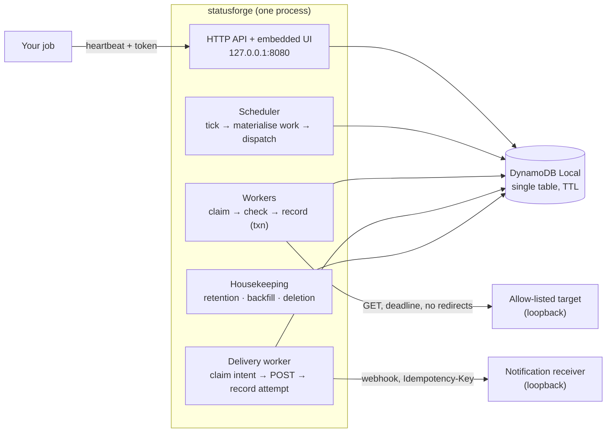

# StatusForge

[](https://github.com/lavinhoque33/StatusForge/actions/workflows/ci.yml)
[](LICENSE)

> Know what is working. Understand what failed. Never confuse silence with health.

StatusForge is a local-first uptime and job monitor for personal applications. It checks HTTP endpoints on a
schedule, watches cron-style jobs through heartbeats, opens and resolves incidents, delivers notifications,
and records deployments — as **one Go binary** with an embedded React UI, backed by DynamoDB Local on your
own machine.

The design problem it takes seriously: a monitor that was itself asleep, crashed, or overloaded must never
report that period as healthy. Every scheduled check is a durable row that ends as either an observation or
an explicit **gap**; summaries count slots, not wall-clock time; "we did not hear from the job" is kept
apart from "the job did not run". The [engineering notes](docs/engineering.md) walk through how.



## Capabilities and boundaries

| Capability | What it does | Boundary it enforces |
| --- | --- | --- |
| **HTTP monitors** | GET an allow-listed `host:port` every 10 s – 15 min, record status, latency, and outcome | Loopback targets only; no redirects; body capped; the same policy checked at save and at dial |
| **Durable scheduling** | Each due instant is a work item with a lease; stale or duplicate results are rejected by conditional writes | Missed slots become gap rows with a reason (`not_scheduled`, `overdue`, `interrupted`, `not_receiving`) — never silently absent |
| **Incidents** | Open after N consecutive counted failures, resolve after M recoveries, inside the same transaction as the observation | Manual checks, superseded configurations, and paused periods are recorded but never counted |
| **Notifications** | Outbox with leases, retry schedule, reminders, manual retry, visible failures | Receiver must be a loopback URL; every attempt is recorded with its outcome |
| **Heartbeats** | Jobs report with a one-time bearer token; late and missed deadlines are evaluated against interval + grace | Deadlines during a StatusForge receive outage are gaps, not misses |
| **Applications and deployments** | Group monitors; record deployment markers via token-authenticated ingest; show nearby deployments on incidents | Markers are context, never a cause or a health signal |
| **Summaries and overview** | 24 h / 7 d coverage, outcomes, latency percentiles with their denominators; a composed attention-first overview | No "uptime %"; truncated reads say so; charts have table equivalents |
| **Data lifecycle** | TTL retention, resumable housekeeping, private export/import, confirmed permanent deletion, format-marked upgrades | Export is private data (`0600`, never overwritten); upgrades are tested against real exports from five earlier builds |
| **Local protection** | Loopback binds, `Host`/`Origin`/`Content-Type`/size rules, strict CSP, `make security-check` | Not authentication: a single-user tool that must never be exposed beyond loopback |
| **Cloud path** | Planner/worker Lambdas on SQS reusing the same store, a synth-only CDK stack, IAM derived from recorded calls | Prepared, not operated: the local binary links no cloud package; synthesis runs in a no-network sandbox; nothing deploys |

## Quick start

Prerequisites: Go 1.27, Node 24, Docker with Compose v2, GNU Make. `make doctor` checks them.

```sh
make setup   # .env from .env.example, Go modules, npm ci
make demo    # seeds a separate demo table and runs UI + API + fixtures at http://127.0.0.1:8080/
```

The demo shows seven days of synthetic history: healthy, failing and slow periods, a coverage gap, open and
resolved incidents, delivered and failed notifications, a maintenance window, a heartbeat with late and
missed reports, and an application with deployment markers. Every page carries a **Demo data** banner.

For your own data:

```sh
make run             # builds, starts DynamoDB Local on loopback, serves http://127.0.0.1:8080/
make sample-target   # second terminal: a loopback fixture with healthy / failing / slow modes
```

Then create a monitor for `http://127.0.0.1:8090/healthy` — see [local setup](docs/development/local-setup.md)
for the walkthrough, every configuration variable, and the heartbeat and deployment fixtures.

| Monitor detail with 7-day summary | Incident with notification history |
| --- | --- |
|  |  |

## How it works



Status is evaluated **on read**: a monitor whose newest counted check is older than two intervals is `stale`
even if that check was healthy, so nothing has to run for a monitor to stop being presented as healthy.

Read more:

- [System overview](docs/architecture/system-overview.md) · [Data model](docs/architecture/data-model.md) ·
  [Scheduling](docs/architecture/scheduling.md) · [Incidents and notifications](docs/architecture/incidents-and-notifications.md) ·
  [Heartbeats and deployments](docs/architecture/heartbeats-and-deployments.md) ·
  [Summaries and overview](docs/architecture/summaries-and-overview.md) · [HTTP API](docs/architecture/http-api.md) ·
  [Cloud path](docs/architecture/cloud-path.md)
- [Architecture decision records](docs/index.md#decisions) — eight ADRs with rejected alternatives
- [Engineering notes](docs/engineering.md) — the five problems worth reading the code for

## Verification

| Command | What it proves |
| --- | --- |
| `make verify` | Go: gofumpt, golines, vet, `-race` tests across 27 packages, build, cloud-package isolation. Web: ESLint, TypeScript, Prettier, Vitest, Vite build. Infra: Prettier, TypeScript, Vitest template assertions, sandboxed `cdk synth` + template check |
| `make security-check` | Pinned `govulncheck`, production `npm audit` (web and infra), licence allowlist, `gitleaks` over tree and history |
| CI `integration` job | Drives the built binary: live `200` / ready `503` without the database, recovery when it appears, DynamoDB-backed store/upgrade/export/cloud-path tests, `200 → 503 → 200` across a database stop, and exit `1` for a wildcard bind or hosted endpoint |
| `cd backend && go run ./cmd/capacity …` | A 50-minute measured run with restart and database-outage stages, auditing raw rows for duplicate slots — [capacity report](docs/operations/capacity-report.md) |

Store tests run against the real DynamoDB Local container and skip loudly when it is absent; they never
substitute an in-memory fake. Details and principles: [testing](docs/development/testing.md). Controls with
the test that proves each, and the candid gaps: [security review](docs/operations/security-review.md).

## Limits

- **Single user, no authentication.** The management API is protected only by loopback binding and
  Host/Origin rules. Never expose it on a LAN or the internet.
- **Coverage needs this machine awake.** When it sleeps or the process stops, nothing is checked; the gap is
  recorded and shown, not backfilled.
- **Throughput is bounded by store work on DynamoDB Local.** One process on the measured workstation
  sustained about 10 scheduled checks per second with no gaps (100 monitors at 10 s, or 250 at the default
  60 s). At 250 monitors at 10 s about 39 % of checks ran; the rest were recorded as gaps and the Overview said
  **Scheduler is behind**.
- **DynamoDB Local is not hosted DynamoDB.** Nothing here claims hosted performance, TTL timing, or IAM
  sufficiency; the cloud path lists [what only real AWS can prove](docs/architecture/cloud-path.md#what-only-real-aws-can-prove).

## Layout

```text
backend/            Go module: cmd/statusforge (API, UI, export/import), cmd/demo, cmd/capacity,
                    cmd/lambda-{planner,worker}, fixtures, internal/*
web/                Vite + React + TypeScript client, embedded by make build
infra/              Synth-only AWS CDK app (TypeScript) with template rules and tests
infrastructure/     Scripts: doctor, demo, security-check, upgrade-fixture generation
tools/              Pinned security tools module (govulncheck, gitleaks)
docs/               Architecture, decisions, engineering notes, operations, development, images
compose.yaml        DynamoDB Local only
Makefile            Every developer entry point (make help)
```

Stack: Go 1.27 (stdlib HTTP, `aws-sdk-go-v2` DynamoDB client), React 19 + TypeScript + Vite + Recharts,
DynamoDB Local 3.3.1, AWS CDK (synthesis only). MIT [LICENSE](LICENSE).
