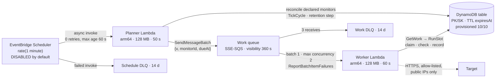

# Cloud path

A serverless execution path for HTTP checks — EventBridge Scheduler → planner Lambda → SQS → worker Lambda →
DynamoDB — that reuses the local product's store and domain packages unchanged. It is **prepared, not
operated**: this repository synthesizes and tests the stack but contains no deploy path, reads no AWS
credentials, and never contacts an AWS endpoint. The rules below are what the template checks and the Go
contract tests enforce.

Implementation: `backend/internal/cloudwork/` (planner pass, worker handler, contract tests),
`backend/internal/checkwork/` (shared slot runner), `backend/internal/cloudtargetpolicy/`,
`backend/internal/hosteddynamo/`, `backend/cmd/lambda-planner`, `backend/cmd/lambda-worker`, `infra/`
(CDK app, template rules, tests). Rationale: [ADR 0008](../decisions/ADR-0008-cloud-path.md).

## Shape

## Planner

One invocation is one pass, bounded to 45 s of work:

1. **Reconcile declared monitors.** `STATUSFORGE_CLOUD_MONITORS` is a JSON array of `{key, name, url,
   intervalSeconds, expectedStatus, deadlineMs}` (`key` 1–64 of `[a-z0-9-]`, intervals 60–3600 s, URL checked
   against the cloud destination policy). Missing keys are created (queuing a `create` run), changed settings
   are updated through the PATCH path (version bump, `config_change` run), undeclared monitors are archived.
   Unchanged declarations write nothing. An invalid declaration fails the pass before any write.
2. **`TickCycle`.** The same store call the local scheduler uses: materialise slots, write `not_scheduled`
   gaps, close overdue and lease-expired work ([scheduling](scheduling.md)).
3. **Retention.** One bounded step of the incident retention job.
4. **Dispatch.** `SendMessageBatch` (groups of 10), one message per **dispatchable** work item: `pending` with
   `dueAt ≤ now < dueAt + interval`, or `claimed` with an expired lease and `attempts < 2`. The durable row
   always exists before its message is sent; a failed send is logged and left for the next pass; duplicates
   are expected and harmless.

A pass that finds the table unavailable fails the invocation; the next minute's schedule is the retry.
Correctness never depends on warm-container memory: the store's in-memory hints (`lastSuccessfulTick`,
`needsRecovery`) are hints only, and a cold start produces the same durable result.

## Worker

Input is an SQS event; output is `SQSEventResponse.batchItemFailures`. Per record: parse
`{"v":1,"monitorId","dueAt"}`, read the work item with a strongly consistent `Store.GetWork`, call
`checkwork.RunSlot`. Records are handled sequentially; if less than `deadlineMs + 15 s` of invocation time
remains, the rest are reported as failures without being claimed.

| `RunSlot` outcome | Message | Why |
| --- | --- | --- |
| `recorded`, `not_eligible`, `lease_held`, `expired`, `missing` | acknowledged (deleted) | The durable row has decided; a redelivery would find nothing to do. A `lease_held` whose holder dies is re-dispatched by the planner after lease expiry. |
| `dependency_failure` (transient DynamoDB error or timeout), `invalid_message` | reported as a batch item failure → redelivered after the visibility timeout → DLQ after 3 receives | Keeps evidence instead of dropping it |

A target failure is recorded evidence, never a processing failure: the worker never retries a message because
the observed outcome was adverse. The message is only a pointer; eligibility is decided by the durable row's
conditions, exactly as for the local worker pool.

## Hosted-store seam and notifications

- `store.New` takes the SDK `*dynamodb.Client`. The local binary builds it only through `localdynamo.New`
  (explicit loopback endpoint, static placeholder credentials). The Lambda binaries build it through
  `hosteddynamo` from the SDK default configuration (execution-role credentials, `AWS_REGION`,
  `STATUSFORGE_TABLE`); it accepts no endpoint override.
- Startup splits: local `Initialize` creates the table, enables TTL, and writes the format marker; hosted
  `Validate` requires an `ACTIVE` table with the `PK`/`SK` string key schema and TTL `ENABLED` on `expiresAt`,
  failing closed with `table_not_ready`, `key_schema_mismatch`, or `ttl_not_enabled`. It uses item-level calls
  only and never `CreateTable`, `UpdateTable`, `UpdateTimeToLive`, or `DeleteTable` — the infrastructure owns
  the table, and IAM enforces the same rule.
- There is no delivery worker in the cloud. With the store option `Notifications: none`, each intent
  (`opened`, `resolved`) is written as `cancelled` / `no_channel` with no `DELIVERY` pointer. Incident events
  are unchanged, `cancelled` is already final for retention, and incident summaries count these as neither
  delivered nor pending. Reminders are not generated because the scheduler maintenance pass does not run.

## Cloud destination policy

`cloudtargetpolicy` mirrors `targetpolicy` for the public internet: `STATUSFORGE_CLOUD_TARGETS` is an explicit
allowlist of `https://host[:port]` origins (default port 443; HTTP, userinfo, fragments, and unlisted hosts
refused). Checked at monitor save and again at dial time. The dialer resolves the host, refuses the
connection if **any** resolved address is non-public, and dials the validated IP with TLS `ServerName` set to
the declared host and normal certificate verification. No proxy, no redirects; the same header, body, and
deadline bounds as local checks.

Non-public: IPv4 loopback, RFC 1918, `100.64.0.0/10`, `169.254.0.0/16` (covers EC2 and Lambda metadata
endpoints), `0.0.0.0/8`, `192.0.0.0/24`, documentation, benchmarking, multicast, `240.0.0.0/4`; IPv6 loopback,
unspecified, `fe80::/10`, `fc00::/7`, multicast, documentation, and IPv4-mapped or NAT64 forms of the above.
The host of `AWS_LAMBDA_RUNTIME_API` is always refused. An empty allowlist refuses every check
(`checker_problem` / `refused_by_policy`), and the committed default is empty. Tests reach a local
`httptest.NewTLSServer` through an unexported, test-only hook; no exported API or environment variable can
loosen the policy.

## Isolation of the local binary

- Each Lambda `main` exits `1` with `not running in AWS Lambda` before reading configuration or credentials
  when `AWS_LAMBDA_RUNTIME_API` is unset.
- `make local-isolation-check` (part of `make backend-check`) fails if `go list -deps ./cmd/statusforge`
  contains `internal/hosteddynamo`, `internal/cloudtargetpolicy`, `internal/cloudwork`,
  `github.com/aws/aws-lambda-go`, `github.com/aws/aws-sdk-go-v2/config`, or
  `github.com/aws/aws-sdk-go-v2/service/sqs`.
- `make lambda-build` cross-compiles `backend/bin/lambda/{planner,worker}/bootstrap` with `GOOS=linux
  GOARCH=arm64 CGO_ENABLED=0 -tags lambda.norpc -trimpath`. It does not package, upload, or deploy.

## Infrastructure (`infra/`)

A TypeScript CDK app with its own lockfile and one environment-agnostic stack, `StatusForge`. No `env`, no
lookups, no `cdk.context.json` (asserted absent after synthesis), no `Fn::GetAZs`, no literal account or
region. `cdk.json` runs the app with Node's built-in type stripping and sets `notices`, `cli-telemetry`, and
`versionReporting` to false. Deploy-time configuration is CDK context, each key defaulting to closed:
`statusforge:cloudMonitors` (`[]`), `statusforge:cloudTargets` (empty → the worker refuses every check),
`statusforge:scheduleState` (`DISABLED`). Committed files never contain a target URL.

### Resources (exactly these; anything else fails the check)

| Type | Count | Settings |
| --- | --- | --- |
| `AWS::DynamoDB::Table` | 1 | `dynamodb.Table` (not `TableV2`, whose provisioned mode requires autoscaled writes): PK/SK strings, no index, `PROVISIONED` 10 RCU / 10 WCU, no autoscaling, TTL `expiresAt`, PITR off, no stream, deletion protection off, removal policy destroy |
| `AWS::SQS::Queue` | 3 | SSE-SQS. Work queue: visibility 360 s, retention 1 day, redrive to its DLQ after 3 receives. Work DLQ and schedule DLQ: 14 days |
| `AWS::SQS::QueuePolicy` | 3 | `enforceSSL` only |
| `AWS::Lambda::Function` | 2 | `provided.al2023`, arm64, 128 MB, handler `bootstrap`, explicit log group. Planner timeout 50 s; worker 60 s. No VPC, reserved/provisioned concurrency, layers, tracing, or URL |
| `AWS::Lambda::EventInvokeConfig` | 1 | Planner: 0 retries, max event age 60 s (the next minute's pass supersedes a failed one) |
| `AWS::Lambda::EventSourceMapping` | 1 | Worker from the work queue: batch size 1, `ReportBatchItemFailures`, max concurrency 2 |
| `AWS::Logs::LogGroup` | 2 | Retention 3 days, removal policy destroy |
| `AWS::Scheduler::Schedule` | 1 | `rate(1 minute)`, flexible window off, state from context, retry max age 60 s / 2 attempts, schedule DLQ |
| `AWS::IAM::Role` | 3 | Planner, worker, schedule. Inline policies only |

Forbidden anywhere in the template: `Custom::*`, `AWS::CDK::Metadata`, `AWS::Lambda::Permission`, function
URLs, KMS keys, VPC resources, SNS topics, alarms. The synthesizer's `BootstrapVersion` parameter and
`CheckBootstrapVersion` rule are allowed.

### IAM

No statement uses a wildcard action or `Resource: "*"`. Table-level writes (`CreateTable`, `UpdateTable`,
`UpdateTimeToLive`, `DeleteTable`) never appear.

| Role | Grants |
| --- | --- |
| Planner | DynamoDB actions from `infra/iam/dynamodb-actions.json` (`planner`) on the table ARN; `sqs:SendMessage` on the work queue; `logs:CreateLogStream`, `logs:PutLogEvents` on its log group |
| Worker | DynamoDB actions (`worker`) on the table ARN; `sqs:ReceiveMessage`, `DeleteMessage`, `ChangeMessageVisibility`, `GetQueueAttributes` on the work queue; the same log actions |
| Schedule | Trusted by `scheduler.amazonaws.com` with an `aws:SourceAccount` condition; `lambda:InvokeFunction` on the planner; `sqs:SendMessage` on the schedule DLQ |

**The DynamoDB action list is derived from the code.** `cloudwork/iam_test.go` wraps the store's client
during the contract tests and records every DynamoDB operation the planner pass and the worker handler
perform; `TestMain` fails if an observed operation is not granted in `dynamodb-actions.json`, and prints the
actions granted but not reached by any test. The stack reads the same file, and `infra/test/stack.test.ts`
asserts each role grants exactly those actions.

### Sandboxed synthesis

`make infra-synth` builds the Lambda binaries, then runs the pinned CDK CLI with `--lookups=false --no-notices
--no-version-reporting`:

- inside `unshare -rn` — a user and network namespace with only loopback, so every network attempt fails;
- under `env -i`, passing only `PATH`, a fresh temporary `HOME` (no `~/.aws`, `~/.cdk`, or SSO cache), and
  `CDK_DISABLE_CLI_TELEMETRY=true`; no `AWS_*` variable is set.

Unsetting `AWS_*` alone is not enough: the CLI resolves a default account through the SDK credential chain,
which also reads shared config files and instance metadata, and it can fetch notices and version data. If
`unshare` is unavailable the target fails; it never falls back to synthesis with network access. The output
(`infra/cdk.out`, git-ignored) is then checked by `infra/scripts/check-template.ts` against the resource and
IAM rules above, plus: no literal account or region, no `Fn::GetAZs`, no URL other than AWS service
principals, no `cdk.context.json`. The same rules (`infra/lib/template-rules.ts`) run on the in-process
template in the Vitest suite, so both paths apply one definition.

No Makefile target, npm script, or CI step runs `bootstrap`, `deploy`, `destroy`, `diff`, `import`, `watch`,
or any `aws` command. The CI `infra` job has `permissions: contents: read`, no secrets, no credentials action,
no `id-token`.

## What only real AWS can prove

Everything above is locally verified against DynamoDB Local, in-process SQS fixtures, and template
assertions. These remain unverified until someone deploys the stack in an account they control:

- SQS duplicate and redelivery behaviour and partial-batch handling by the real event source mapping;
- Lambda cold-start and timeout behaviour, the real `AWS_LAMBDA_RUNTIME_API` and metadata addresses;
- EventBridge Scheduler precision and retries, and asynchronous invocation semantics;
- DynamoDB operations no contract test reaches (the IAM list is proven for exercised paths only);
- hosted DynamoDB transactions, `TransactionConflictException`, throttling at provisioned capacity, TTL
  deletion timing (days);
- IAM sufficiency and least privilege;
- outbound HTTPS from Lambda to an allow-listed target;
- Lambda accepting an empty environment value (`STATUSFORGE_CLOUD_TARGETS=""`, the closed default);
- CloudWatch Logs volume and actual usage against any free allowance;
- complete teardown.

A deployment would also need `cdk bootstrap` (an S3 staging bucket, an ECR repository, IAM roles, an SSM
parameter) and a cleanup plan: disable the schedule, drain the queues, destroy the stack, remove the
bootstrap stack and its retained bucket, verify nothing remains. None of that is performed by this repository.
