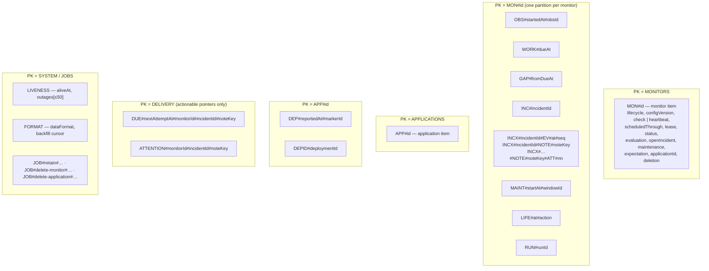

# Data model

One DynamoDB table (`STATUSFORGE_DYNAMODB_TABLE`, default `statusforge`), key schema `PK` (string, hash) and
`SK` (string, range), no secondary index, TTL enabled on `expiresAt`. Every item carries `entityType`. All
access patterns are `GetItem`, `Query` on a key prefix, `PutItem`/`UpdateItem` with a condition, or
`TransactWriteItems`; the product never scans the table except for export and the one-time format backfill.

Sort keys that encode time use the fixed-width UTC layout `2006-01-02T15:04:05.000000000Z`, so lexical order
equals time order. IDs are opaque `crypto/rand.Text()` values (26 base32 characters); ordering always comes
from an explicit attribute, never from an ID.

Implementation: `backend/internal/store/` (key helpers in `scheduling.go`, expiry in `store.go`), lifetimes in
`backend/internal/retention/`.

## Partitions and items

### Catalogue

| Entity | `PK` | `SK` | Purpose | Lifetime (`expiresAt`) |
| --- | --- | --- | --- | --- |
| Monitor | `MONITORS` | `MON#<monitorId>` | Configuration, lifecycle, schedule cursor, lease, current status evidence, evaluation runs, open-incident pointer, maintenance index, heartbeat expectation | never |
| Observation | `MON#<id>` | `OBS#<startedAt>#<observationId>` | One check result, heartbeat report, or missed deadline; `counted` + `notCountedReason`; request snapshot; `maintenanceWindowId` | start + 90 d |
| Work item | `MON#<id>` | `WORK#<dueAt>` | One scheduled slot: `pending → claimed → done | cancelled | missed`, `attempts`, `claimToken`, `leaseUntil` | due + 7 d |
| Gap | `MON#<id>` | `GAP#<fromDueAt>` | Slots that produced no observation: `missedCount`, `reason` (`not_scheduled`, `overdue`, `lease_expired`, `not_observed`) | recorded + 90 d |
| Incident | `MON#<id>` | `INC#<incidentId>` | `open | resolved`, resolution, opening/recovery evidence snapshots, counters, `applicationId` at open | resolved + 365 d (stamped by job) |
| Incident event | `MON#<id>` | `INCX#<incidentId>#EV#<at>#<seq>` | Timeline: opened, paused, resumed, config_changed, maintenance_started/ended, resolved | with incident |
| Notification | `MON#<id>` | `INCX#<incidentId>#NOTE#<noteKey>` | Outbox row: payload built once, state machine, lease while sending | with incident |
| Delivery attempt | `MON#<id>` | `INCX#<incidentId>#NOTE#<noteKey>#ATT#<nn>` | One send: result, HTTP status, duration, manual flag | with incident |
| Maintenance window | `MON#<id>` | `MAINT#<startAt>#<windowId>` | Scheduled window; `cancelledAt` | effective end + 365 d |
| Lifecycle event | `MON#<id>` | `LIFE#<at>#<action>` | created / paused / resumed / archived, for paused-time accounting | at + 365 d |
| Run guard | `MON#<id>` | `RUN#<runId>` | Heartbeat `runId` duplicate detection | receipt + 7 d |
| Application | `APPLICATIONS` | `APP#<applicationId>` | Name, token hash + hint, archived | never |
| Deployment marker | `APP#<id>` | `DEP#<reportedAt>#<markerId>` | Version, description, link, source (`ingest | manual`) | reported + 365 d |
| Deployment guard | `APP#<id>` | `DEPID#<deploymentId>` | Duplicate detection | reported + 365 d |
| Due pointer | `DELIVERY` | `DUE#<nextAttemptAt>#<monitorId>#<incidentId>#<noteKey>` | Notification that needs a send attempt | never (deleted on completion) |
| Attention pointer | `DELIVERY` | `ATTENTION#<monitorId>#<incidentId>#<noteKey>` | Failed notification awaiting a human | with incident |
| Liveness | `SYSTEM` | `LIVENESS` | `aliveAt` written every 10 s; up to 50 `{from,to}` receive outages | never |
| Format marker | `SYSTEM` | `FORMAT` | `dataFormat`, `writtenBy`, `upgradedFrom`, backfill cursor and state | never |
| Job pointer | `JOBS` | `JOB#retain#…`, `JOB#delete-monitor#…`, `JOB#delete-application#…` | Housekeeping work that must survive restarts | never (deleted when done) |

## Why the monitor item is "fat"

The monitor item holds the schedule cursor, the lease, the current status evidence, the incident evaluation
runs, the open-incident pointer, the maintenance index, and the heartbeat expectation. That is deliberate:
every rule that decides whether a result *counts* (lifecycle, version, lease token, newer status, evaluation
revision, maintenance windows) is evaluated as a **condition on the same item** in the transaction that
records the result. There is no second item whose state could disagree, and no read-then-write window
between "is this eligible?" and "record it".

The costs: the monitor list is one partition (`PK = MONITORS`), and each monitor item is a few KB. Both are
acceptable at the scale this product targets (hundreds of monitors, not millions); the capacity report
measured 250 monitors at a 10 s interval ([capacity report](../operations/capacity-report.md)).

## Conditional-write rules

| Write | Condition |
| --- | --- |
| Create monitor / application | `attribute_not_exists(PK)` |
| Edit check settings or name | `configVersion = :expected AND lifecycle <> "archived"` |
| Pause / resume | `lifecycle = :from` |
| Archive | `lifecycle <> "archived"` |
| Advance schedule cursor | `scheduledThrough = :previous AND lifecycle = "active"` |
| Claim work | work: `state = pending OR (state = claimed AND leaseUntil < :now AND attempts < 2)`; monitor: `lifecycle = active AND configVersion = :v AND (attribute_not_exists(lease) OR lease.until < :now)` |
| Record counted result | `lease.token = :token AND lifecycle = active AND configVersion = :v AND (attribute_not_exists(status) OR status.startedAt < :startedAt) AND evaluation.revision = :rev` |
| Record not-counted result | `lease.token = :token` (observation still written with `counted: false`) |
| Record heartbeat report | monitor: `lifecycle = active AND kind = heartbeat AND token.hash = :auth AND evaluation.revision = :rev`; guard: `attribute_not_exists(PK) OR expiresAt < :now` |
| Judge heartbeat deadline | `expectation.dueAt = :due AND lifecycle = active` |
| Open / extend / resolve incident | incident `attribute_not_exists` / `state = "open"`; monitor `openIncident.id = :id` |
| Create reminder | `openIncident.id = :id AND openIncident.nextReminderAt = :due` |
| Claim notification | `state IN (pending, retry_wait) OR (state = sending AND lease.until < :now)` |
| Complete delivery attempt | `lease.token = :token` |
| Record maintenance boundary | `maintenance.activeId = :previous` |
| Start deletion | archived, `attribute_not_exists(deletion)` |
| Any write under deletion | refused by the `deletionGuard` middleware and by `attribute_not_exists(deletion)` conditions |

A failed condition is mapped to a typed store error (`ErrLeaseHeld`, `ErrNotEligible`, `ErrVersionConflict`,
…) and then to a `409` reason at the API; no SDK error reaches a handler or a log line.

## Retention

Lifetimes are fixed in `internal/retention` and listed by `GET /api/system`. Readers of every expiring type
skip rows whose `expiresAt` has passed, so physical deletion by TTL (seconds on DynamoDB Local, typically days
on hosted DynamoDB) never changes an API result. Protected: open incidents and their children carry no
`expiresAt`; an incident with a non-final notification is not stamped; `DUE#` pointers never expire. The
housekeeping worker stamps resolved incidents through `JOB#retain#…` pointers written in the resolution
transaction ([ADR 0007](../decisions/ADR-0007-retention-and-release.md)).

## Format marker and upgrades

`SYSTEM`/`FORMAT` records `dataFormat: 6`. A table with items but no marker is treated as earlier-format data:
the marker is written with `upgradedFrom: "unmarked"` and a resumable backfill stamps `expiresAt` on records
that predate retention. A marker with a higher format refuses startup. Read-time fallbacks (`legacy.go`)
cover older item shapes. `backend/internal/upgrade` imports five committed exports written by earlier builds
(`testdata/m1.jsonl` … `m5.jsonl`, each with a facts manifest) into fresh tables and asserts every fact is
still returned by the current readers.
