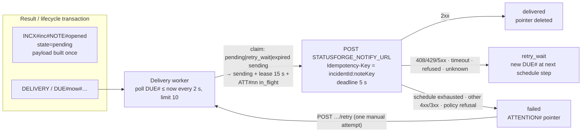

# Incidents and notifications

How counted evidence becomes incidents, how incidents become notification obligations that survive crashes,
and how maintenance windows suppress both without hiding evidence.

Implementation: `backend/internal/incident/` (pure evaluation, payloads, retry schedule),
`backend/internal/store/incidents.go`, `evaluation.go`, `maintenance.go` (transactions), `backend/internal/notify/` (delivery worker),
`backend/internal/scheduler/` (reminders, maintenance boundaries). Rationale:
[ADR 0004](../decisions/ADR-0004-incidents-notifications.md).

## Evaluation inside the result transaction

Incident state is never evaluated from a stream after the fact. `incident.Evaluate(policy, evaluation,
openIncident, observation, now)` is a pure function called while building the counted-result transaction
([scheduling](scheduling.md#one-slot-claim--check--record)); its outputs — the next runs, an optional
transition, and notification intents — are written in the same `TransactWriteItems` as the observation and
the status, conditioned on `evaluation.revision`. Incident state therefore cannot disagree with the evidence
that produced it, and only the lease holder (one per monitor) ever writes counted results.

`incidentPolicy {openAfter, recoverAfter}` is 1–5 each, default 2 for HTTP monitors and 1 for heartbeats.
Runs hold up to 5 evidence snapshots `{observationId, startedAt, initiatedBy, outcome, reason, observedStatus,
configVersion, kind}`, so incidents stay interpretable after the observations expire.

| Counted observation | No open incident | Open incident |
| --- | --- | --- |
| `failing` | append to failing run, clear healthy run; **open** when the run reaches `openAfter` | `failureCount + 1`, `lastFailure` updated; clear healthy run |
| `healthy` | clear failing run | append to healthy run; **resolve** (`recovered`) when it reaches `recoverAfter` |
| `checker_problem` | runs unchanged | `checkerProblemCount + 1`, `lastCheckerProblem` updated; runs unchanged |
| maintenance-labelled | runs unchanged | runs unchanged; `maintenanceObservationCount + 1` |

Not-counted observations never reach evaluation. A gap, resume, check-setting change, and a maintenance
boundary clear both runs (each bumps `evaluation.revision`). Only `failing` opens an incident: a checker
problem is StatusForge's fault, not the target's. If the transaction is cancelled solely because the
revision moved, the recorder re-reads and retries up to 3 times.

```mermaid
stateDiagram-v2
  [*] --> NoIncident
  NoIncident --> Open: failing run reaches openAfter
  Open --> Open: failing (extend) · checker_problem · maintenance · pause/resume · config change
  Open --> Resolved: healthy run reaches recoverAfter (recovered)
  Open --> Resolved: monitor archived (archived)
  Resolved --> [*]
  note right of Resolved: never mutated again; a later failure opens a new incident
```



## Incident shape

`{id, monitorId, monitorName, applicationId, state, resolution, openedAt, resolvedAt, openingEvidence[],
recoveryEvidence[], failureCount, firstFailureAt, lastFailure, checkerProblemCount, lastCheckerProblem,
maintenanceObservationCount, monitoringPaused, inMaintenance, notificationSummary {delivered, pending,
failed}}`. `incidentId` is time-ordered (`20260928T101530123Z-ab12cd`), so a descending `INC#` query lists a
monitor's incidents newest first without touching children, and one `begins_with INCX#<id>` query returns
the whole timeline.

Timeline events: `opened`, `paused`, `resumed`, `config_changed {fromVersion, toVersion}`,
`maintenance_started`, `maintenance_ended`, `resolved {resolution}`. Gaps inside the incident's range and
deployment markers of its application within `[openedAt − 2 h, resolvedAt | now]` are read alongside, not
copied.

## Outbox and delivery

Every notification obligation is a row written in the transaction that created the need for it; nothing is
held only in memory.



- `noteKey` ∈ `opened`, `reminder#<nnnn>`, `resolved` is the idempotency key: a transition or reminder slot
  can never produce two notifications. The same string is sent as `Idempotency-Key`, so a receiver can detect
  a duplicate after an `outcome_unknown` retry.
- The `DELIVERY` partition holds only actionable pointers. Delivered notifications leave it, so its size is
  bounded by undelivered and failed work, not by history.
- The claim transaction takes over an expired `sending` lease and marks the previous attempt
  `process_stopped`, so a crash mid-send is recorded, not lost. Completion is conditioned on `lease.token`.
- Ordering: a `reminder` or `resolved` is not attempted until the incident's `opened` is `delivered`, `failed`,
  or `cancelled`. A `reminder` for an incident that is no longer open is `cancelled` (`incident_resolved`).

### Result classification

| Situation | `result` | Next state |
| --- | --- | --- |
| 2xx | `delivered` | `delivered` |
| 408, 429, 5xx | `http_error` | retry, or `failed` when the schedule is exhausted |
| other 4xx, 3xx | `rejected` | `failed` at once |
| deadline before the request was fully written | `timeout` | retry |
| `ECONNREFUSED` | `connection_refused` | retry |
| deadline or connection closed **after** the request was fully written, no status | `outcome_unknown` | retry |
| other network error before the request was written | `connection_error` | retry |
| dial-time policy refusal | `refused_by_policy` | `failed` at once |
| lease expired while `sending` | `process_stopped` (recorded on the next claim) | retry |

Retry delays come from `STATUSFORGE_DELIVERY_RETRY_SCHEDULE` (default `10s,30s,90s,5m,15m,30m`; attempts =
entries + 1) and are minimums measured from the end of the previous attempt. Delivery is at-least-once by
design and never claimed to be exactly-once.

### Payload

`POST STATUSFORGE_NOTIFY_URL` with `Content-Type: application/json`, `Idempotency-Key`, and a body built once
at intent time:

```json
{
  "schema": "statusforge.notification.v1",
  "id": "20260928T101530123Z-ab12cd:opened",
  "kind": "opened",
  "reminderSeq": null,
  "monitor": {"id": "…", "name": "…", "kind": "http", "url": "http://127.0.0.1:8090/"},
  "incident": {"id": "…", "openedAt": "…", "resolvedAt": null, "resolution": null, "failureCount": 2,
               "path": "/incidents/<monitorId>/<incidentId>"},
  "evidence": [ … ],
  "createdAt": "…"
}
```

The sender is built like the checker: no proxy, no keep-alive, no redirects, dial-time loopback and
allow-list check against the notify `host:port` (which is separate from monitor targets), response body read
up to 4 KiB and discarded. Log lines carry IDs, attempt number, result, status, and duration — never the
payload.

## Reminders

Reminder slot *k* is `openedAt + k × STATUSFORGE_REMINDER_INTERVAL_SECONDS` (default 6 h). In each tick, for
each active monitor whose `openIncident.nextReminderAt ≤ now`, one transaction conditioned on
`openIncident.nextReminderAt = :due` moves the cursor to the first slot **after now**, increments
`reminderSeq`, and puts the `reminder#<seq>` notification with its due pointer. Missed slots (downtime,
backlog) collapse into one reminder; paused monitors are skipped and resume moves the cursor past now, so a
pause never produces a late reminder.

## Maintenance windows

A window `{startAt, endAt, note}` must start no earlier than 5 minutes ago, last at most 7 days, not overlap
another non-ended window, and a monitor holds at most 10 non-ended windows. Checks **continue** during a
window; suppressing them would lose the evidence that coverage summaries report.

- **Labelling is decided at claim time** from the monitor's window index and the check's `startedAt`, and
  travels with the work to the result as `maintenanceWindowId`. A result recorded after the end boundary
  keeps its label; a check claimed before a window and recorded inside it keeps its unlabelled classification
  and can open an incident.
- Labelled evidence is counted for status (the monitor still shows `failing` if it is) but is excluded from
  incident evaluation and from latency figures, and reported separately in summaries.
- **Boundaries** are recorded by the tick: on start, set `maintenance.activeId`, clear runs, add a
  `maintenance_started` event to an open incident; on end, remove `activeId`, drop the window, clear runs, add
  `maintenance_ended`. Both are conditional on the previous `activeId`, so a boundary is recorded once even
  across restarts. While the scheduler is down, evidence is still labelled by time, so it is excluded correctly.
- **Notifications:** `opened` and `reminder` delivery is deferred while a window is active (computed from times)
  and resumes afterwards; `resolved` is never deferred. Presentation (`state`, `maintenance.active/next`,
  `inMaintenance`) is computed from times, never from boundary bookkeeping.
- Cancelling a scheduled window marks it `cancelled`; cancelling an active one ends it now.

Recurring windows are deliberately absent: cron-like rules need time-zone and DST semantics the product does
not yet need.

## Failure modes exercised by tests

| Scenario | Expected behaviour | Where |
| --- | --- | --- |
| Receiver returns 503 for every attempt | `http_error` × schedule, then `failed` with `ATTENTION#`; Overview banner; manual retry makes one attempt | `notify/*_test.go`, `store/incidents_flow_test.go` |
| Receiver drops the connection after the request body | `outcome_unknown`, retried; receiver fixture reports `duplicate: true` on the retry's `Idempotency-Key` | `notify`, `notifyreceiver` |
| Process stops mid-send | next claim records `process_stopped` on the in-flight attempt and retries | `store/incidents_flow_test.go` |
| Gap or lifecycle write races the result transaction | `evaluation.revision` conflict → re-read and retry (≤ 3) | `store/incidents_revision_test.go` |
| Archive with an open incident | `resolved (archived)` + `resolved` notification; pending reminders cancelled | `store/incidents_lifecycle_test.go` |
| Window active when failures occur | evidence labelled, no incident, `opened` deferred until the window ends | `store/maintenance_test.go` |
