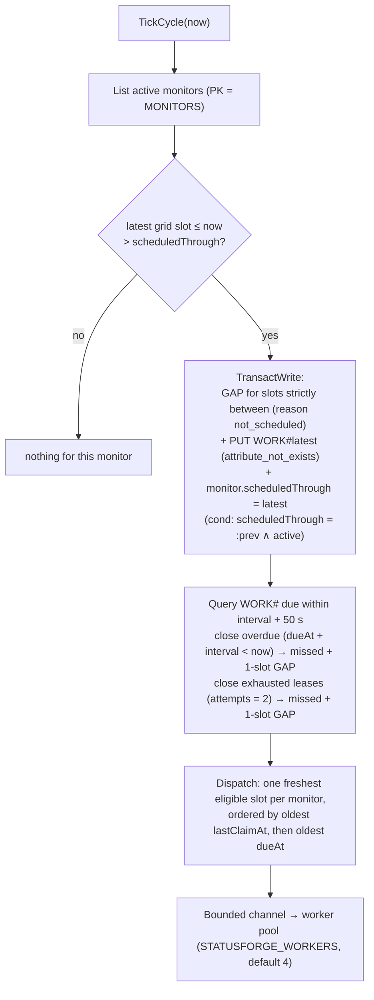

# Scheduling

How a monitor's interval becomes a stream of checks that survives crashes, restarts, slow targets, and
concurrent writers without ever losing an obligation or letting an old result overwrite a newer one.

Implementation: `backend/internal/scheduler/` (tick loop, dispatch, pool, coverage),
`backend/internal/checkwork/` (one slot), `backend/internal/store/scheduling.go` (transactions),
`backend/internal/monitor/` (grid math, status evaluation). Rationale:
[ADR 0003](../decisions/ADR-0003-scheduling-persistence.md).

## Vocabulary

| Term | Meaning |
| --- | --- |
| **Slot** | A due instant on a monitor's grid: `k × interval + offset`, where `offset = fnv32a(monitorId) mod interval` (ms). Deterministic, never stored. |
| **Work item** | `WORK#<dueAt>`: the durable record that a slot is owed. State `pending → claimed → done | cancelled | missed`. |
| **Lease** | `monitor.lease {token, until, kind}`: one check in flight per monitor across scheduled and manual checks. `until = deadlineMs + 10 s`. |
| **Counted** | An observation that was allowed to update the monitor's current status. Otherwise `counted: false` with `notCountedReason`. |
| **Gap** | `GAP#<fromDueAt>`: slots that produced no observation, with `missedCount` and `reason`. Append-only, never merged. |
| **Stale** | Presented state when `now − status.completedAt > 2 × interval + deadline`. Computed on read, never stored. |

## The tick (every 2 s)

Properties:

- **Exactly one record per slot.** The gap, the work item, and the cursor move in one transaction. A lost
  race (another tick or process advanced the cursor) cancels the transaction and is ignored.
- **Catch-up is one run.** After downtime a monitor gets at most one catch-up check (the newest slot);
  everything between becomes a single `not_scheduled` gap. Creation and resume set `scheduledThrough` to the
  newest slot ≤ now, so pre-creation and paused time are never gaps.
- **Cost does not grow with history.** Each tick queries only `WORK#` items due within `interval + 50 s`.
  A startup sweep covers retained history once; after a failed tick for a monitor, only that monitor's
  recovery window widens.
- **Fairness under saturation.** Candidates are ordered by the monitor least recently claimed, so a full
  pool spreads missed slots across monitors instead of starving the one with the latest offset. A full pool
  leaves work `pending`; the next tick offers it again. Per-monitor store work in a pass runs with at most 8
  monitors in flight.

The same tick also runs the heartbeat deadline step, the liveness write, reminder creation, and maintenance
boundary bookkeeping (each documented with its subsystem).

## One slot: claim → check → record

`checkwork.RunSlot(ctx, work, now)` is called by the local worker pool and, unchanged, by the cloud worker
Lambda.

**Claim** is one transaction:

- work item: `state = pending OR (state = claimed AND leaseUntil < :now AND attempts < 2)`; sets `claimed`,
  `claimToken`, `leaseUntil`, `attempts + 1`;
- monitor: `lifecycle = active AND configVersion = :workVersion AND (attribute_not_exists(lease) OR
  lease.until < :now)`; sets `lease`, `lastClaimAt`.

If the monitor condition fails because the monitor is paused, archived, or on a newer version, the work item
is closed as `cancelled` with that reason. If another lease is live, the work stays `pending` for a later tick.

**Check** runs under its own context with deadline `check.deadlineMs` — not the request or tick context. The
client has no proxy, no keep-alive, no redirects (a 3xx is the observed status), a 64 KiB header cap, and
reads at most `maxBodyBytes + 1` bytes before discarding. The dialer resolves the host, refuses any
non-loopback address, re-checks the allow-list, and dials the literal IP (`internal/targetpolicy`).

| Situation | `outcome` | `reason` |
| --- | --- | --- |
| Status equals `expectedStatus`, body read before the deadline | `healthy` | `ok` |
| Status differs | `failing` | `wrong_status` |
| Deadline exceeded at any point | `failing` | `timeout` |
| `ECONNREFUSED` | `failing` | `connection_refused` |
| Other network or protocol error | `failing` | `connection_error` |
| Dial-time policy refused the target | `checker_problem` | `refused_by_policy` |
| Runner panic or internal error | `checker_problem` | `internal` |

Latency within the deadline never changes the outcome. A `checker_problem` is StatusForge's fault, not the
target's, and never opens an incident.

**Record** tries two transactions in order:

1. **Counted.** Monitor condition `lease.token = :token AND lifecycle = active AND configVersion = :v AND
   (attribute_not_exists(status) OR status.startedAt < :startedAt) AND evaluation.revision = :rev`; sets
   `status`, removes `lease`, applies incident evaluation; puts the observation (`counted: true`); marks the
   work `done`. Incident transitions and notification intents join this transaction
   ([incidents](incidents-and-notifications.md)).
2. **Not counted** (only when the monitor condition cancelled the first). Monitor: `lease.token = :token`,
   remove `lease`. Observation written with `counted: false` and `notCountedReason` ∈ `paused`, `archived`,
   `config_changed`, `older_than_current`, `lease_lost`. Work marked `done` if the token still matches.

The observation is always written, so no result is lost; only the status update is conditional. The
`status.startedAt < :startedAt` guard is what makes a slow old result finishing after a newer one harmless.

`RunSlot` returns one of `recorded`, `not_eligible`, `lease_held`, `expired`, `dependency_failure`; the
caller (local pool or Lambda) decides what to log, count, or acknowledge.

## Guarantees

1. Each due slot of an active monitor ends as exactly one of: an observation, a cancellation with a reason,
   or a gap.
2. After downtime, a monitor gets at most one catch-up run; earlier slots become one gap.
3. At most one check per monitor is in flight across scheduled and manual checks.
4. A slow target occupies one worker for at most its deadline; other monitors keep their cadence while
   `workers` > number of simultaneously slow monitors.
5. An observation from an old `configVersion`, a paused or archived monitor, or older than the stored status
   is stored with `counted: false` and never changes status.
6. Shutdown drains in-flight checks up to 30 s; after a crash, claimed work is retried once within its
   interval or recorded as a `lease_expired` gap.

These are the invariants the scheduler and store tests assert (`scheduler/*_test.go`,
`store/scheduling_test.go`, `cloudwork/drills_test.go` for the shared runner under redelivery and expiry).

## Status is evaluated on read

The stored `status` map is evidence, not a verdict. `monitor.Evaluate` computes the presented state from the
item and the clock:

| Condition (first match) | State / reason |
| --- | --- |
| `lifecycle = archived` | `archived` |
| `lifecycle = paused` | `paused` |
| no `status` | `unknown` / `no_checks` |
| `status.configVersion < configVersion` | `unknown` / `config_changed` |
| `now − status.completedAt > 2 × interval + deadline` | `stale` |
| otherwise | `status.outcome` |

`freshUntil` is returned so the web can flip to `stale` locally without a request. Nothing stores `stale` or
`unknown`: storing them would let a row claim knowledge it does not have.

## Lifecycle and configuration writes

| Change | Effect on scheduling |
| --- | --- |
| Create | monitor item + `create` work item at `dueAt = now`, one transaction |
| Pause / archive | no eager work cleanup; pending work is cancelled at claim time |
| Resume | `scheduledThrough` = newest slot ≤ now + `resume` work item, one transaction |
| Check-setting change | version bump + `config_change` work item; old-version work cancelled at claim |
| Interval change | no version bump; cursor reset to the newest slot on the new grid, no gap |

## Coverage state

`GET /api/system/scheduler` reports `{state, windowMinutes, dueChecks, missedChecks, workers}` from in-process
counters (no table access, so it stays cheap when the Overview is slow under load):

- `ok`; `behind` when more than 5 % of due checks in the last 5 minutes were closed `overdue`; `unknown` until
  a due check has resolved since process start; `disabled` when `STATUSFORGE_SCHEDULER_ENABLED=false`.
- Only slots due after the process started count, and retries are not counted, so a restart reads
  `unknown` until there is evidence and downtime stays visible as `not_scheduled` gaps.
- The Overview shows **Scheduler is behind** with the counts and the guidance to use longer intervals or
  fewer monitors first, and more `STATUSFORGE_WORKERS` only for slow targets.

Transitions log `scheduler coverage degraded` (WARN) and `scheduler coverage recovered` (INFO). Each pass
logs at most one `scheduler tick` line, only when a count is non-zero.

## Shutdown and restart

On SIGINT/SIGTERM the loop stops ticking, workers stop claiming, and in-flight checks get up to 30 s to
record. Anything still `claimed` afterwards is recovered through lease expiry: a crash and a clean stop use
the same path. The [capacity report](../operations/capacity-report.md) records an API restart and a database
outage under a 100-monitor load with no duplicate observation per slot.

## Measured limits

At a 10 s interval on one workstation against the loopback fixture: 100 monitors scheduled with zero gaps
(p95 schedule delay 2.8 s, ~610 checks/min); 250 monitors could not keep up — throughput stayed at ~607
checks/min, 8 817 slots were closed as `overdue` gaps in 10 minutes, and the coverage state reported
`behind` throughout. The limit was the store work per check (claim + result transaction on single-node
DynamoDB Local), not the worker count. At the default 60 s minimum, 250 monitors ran with zero gaps.
Details and reproduction: [capacity report](../operations/capacity-report.md).
