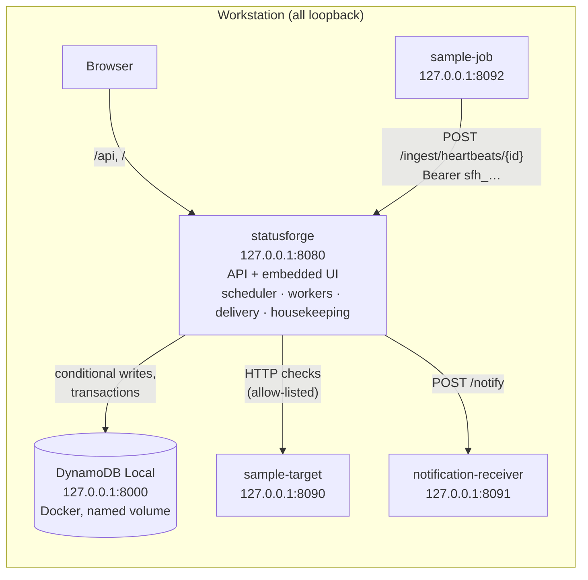
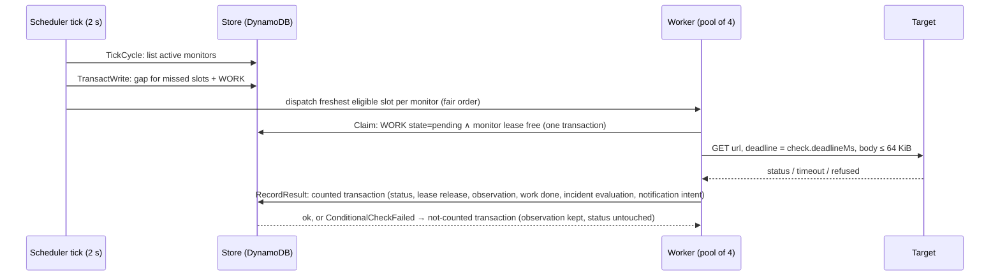

# System overview

StatusForge is a single Go process plus a DynamoDB table. The process serves the management API and the
embedded web UI, runs the check scheduler and worker pool, evaluates incidents, delivers notifications, and
performs housekeeping. Every listener binds to loopback; the only database is DynamoDB Local in Docker. A
separately built cloud path (two Lambda binaries and a CDK stack) reuses the same store and domain packages
but is synthesized only, never deployed from this repository.

## Runtime shape

The three fixtures (`sample-target`, `notification-receiver`, `sample-job`) are controllable stand-ins for
things StatusForge would monitor, notify, or receive reports from. They are the only targets the local
product can reach: the allow-list `STATUSFORGE_ALLOWED_TARGETS` and the dial-time policy in
`internal/targetpolicy` refuse everything else, including any resolved non-loopback address.

## Request to evidence: one scheduled check

Every slot of an active monitor ends as exactly one of: an observation (`done`), a cancellation with a
reason, or a gap. Nothing is silently dropped, and a slow old result can never overwrite a newer status
([scheduling](scheduling.md)).

## Backend packages

One Go module, `backend/`. Domain packages are stdlib-only and never import `net/http` server types, chi, or
the AWS SDK; the store is the only product package that talks to DynamoDB.

| Package | Role |
| --- | --- |
| `cmd/statusforge` | The product binary: `serve` (default), `export`, `import`, `version`. Embeds the built web UI. |
| `internal/config` | Reads `STATUSFORGE_*` into a validated `Config`; loopback listen guard; explicit loopback DynamoDB endpoint. Never reads `AWS_*`. |
| `internal/netguard` | Loopback host classification shared by every binary. |
| `internal/localdynamo` | DynamoDB client from an explicit endpoint and static placeholder credentials; readiness `Ping`. Never the default credential chain. |
| `internal/store` | Every DynamoDB access pattern: conditional writes, transactions, bounded queries, typed errors. Exposes domain types only. |
| `internal/monitor` | Monitor and observation types, validation, lifecycle transitions, grid math, status evaluated on read. |
| `internal/targetpolicy` | Allow-list parsing, save-time URL validation, dial-time resolver and dialer. |
| `internal/checker` | Runs one HTTP check with a hardened client and classifies the outcome. |
| `internal/checkwork` | Claim → check → record for one slot. Shared by the local scheduler and the cloud worker. |
| `internal/scheduler` | Tick loop, fair dispatch, worker pool, coverage state, heartbeat deadlines, liveness writer, reminders, maintenance boundaries, shutdown drain. |
| `internal/incident` | Pure evaluation: runs, thresholds, transitions, notification intents, retry schedule, payloads. |
| `internal/notify` | Delivery worker: claims due notifications, sends with the dial-time policy, classifies results. |
| `internal/heartbeat` | Report validation, deadline arithmetic, late/missing classification, outage containment, token format and hashing. |
| `internal/summary` | Slot-based coverage, latency percentiles, bucket alignment, paused spans. |
| `internal/retention` | Fixed lifetimes per record type. |
| `internal/housekeeping` | Resumable format backfill, incident retention jobs, permanent deletion jobs. |
| `internal/dataexport` | Validated JSON Lines export and import. |
| `internal/httpapi` | chi router, middleware, protection rules, handlers, error mapping. Transport only. |
| `internal/webui` | Serves the embedded single-page app with CSP headers and history fallback. |
| `internal/buildinfo` | Version from `-ldflags`, VCS revision, or `dev`. |
| `internal/sampletarget`, `internal/notifyreceiver`, `internal/samplejob` | Fixtures. Never imported by the product. |
| `internal/cloudwork`, `internal/cloudtargetpolicy`, `internal/hosteddynamo`, `cmd/lambda-*` | Cloud path ([cloud path](cloud-path.md)). Never linked into `cmd/statusforge`. |
| `cmd/capacity`, `cmd/demo`, `cmd/upgrade-fixture-table` | Operator and evidence tooling. |

## Web (`web/`)

Vite + React 19 + TypeScript, no state library, a tiny history-based router, Recharts loaded lazily. The
client presents backend state: incident thresholds, freshness, eligibility, and coverage arithmetic live in
the backend and the web never recomputes them. Pages: Overview, Monitors (list, create, detail with timeline,
summary, maintenance, incidents), Incidents, Activity, Applications, Settings. Lists poll every 15 s while
the tab is visible; summaries refresh every 60 s.

## Persistence

One table, `PK`/`SK` string keys, `entityType` discriminator, no secondary index, TTL on `expiresAt`. Every
state change is a conditional write or a `TransactWriteItems`; readers compute presentation (`unknown`,
`stale`, `late`) from stored evidence and the clock. Keys and the full item catalogue are in
[data model](data-model.md).

## Subsystem documents

| Document | Covers |
| --- | --- |
| [Data model](data-model.md) | Table, key prefixes, item attributes, retention per type, conditional-write rules |
| [Scheduling](scheduling.md) | Grid slots, work items, leases, counted/not-counted results, gaps, fair dispatch, coverage state, shutdown |
| [Incidents and notifications](incidents-and-notifications.md) | Evaluation rules, incident shape, outbox and delivery, reminders, maintenance windows |
| [Heartbeats and deployments](heartbeats-and-deployments.md) | Heartbeat monitors, ingest, tokens, deadlines, receive liveness, applications, deployment markers |
| [Summaries and overview](summaries-and-overview.md) | Slot-based coverage, latency, buckets, overview composition, cursor paging |
| [HTTP API](http-api.md) | Route catalogue, error format, protection rules |
| [Cloud path](cloud-path.md) | Planner and worker Lambdas, hosted-store seam, destination policy, CDK stack rules, sandboxed synthesis |

Design rationale and rejected alternatives are in the [decision records](../decisions/).

## Security boundaries in force

- Loopback-only listeners for API, database, fixtures, and dev server, enforced in `config.Load` before
  `net.Listen`.
- No ambient AWS credential discovery in the local binary: explicit endpoint and static placeholder
  credentials only. `make local-isolation-check` fails the build if `cmd/statusforge` links a cloud-only package.
- Outbound requests (checks and notifications) go through a dial-time policy that resolves the host, refuses
  any non-loopback address, and dials the validated IP. No proxy, no redirects, no keep-alive, bounded headers
  and body.
- `Host` must be loopback on every route; state-changing `/api` requests refuse cross-site origins; bodies are
  capped (64 KiB API, 4 KiB ingest); the served page has a strict CSP.
- Logs carry method, path, status, duration, request ID, and domain IDs — never bodies, headers, query
  strings, or token material.

See [security review](../operations/security-review.md) for the controls, their tests, and known gaps.
