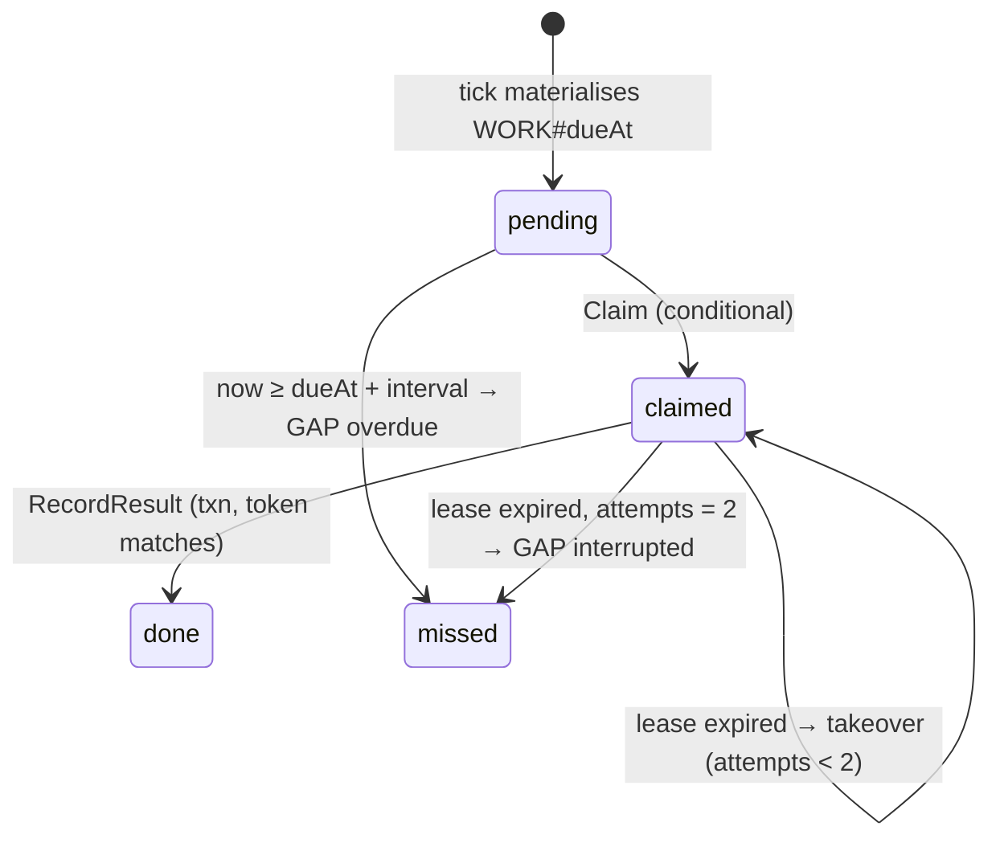

# Engineering notes

Five problems in StatusForge where the obvious implementation is wrong in a way that only shows up under
restarts, concurrency, or outages — and what the code does instead. Each section links the implementation
and the tests that pin the behaviour. The [architecture docs](index.md#architecture) describe each subsystem
in full; this page is the short tour.

## 1. A scheduled check is a durable row, not a goroutine

**Problem.** A `time.Ticker` plus a worker pool loses work invisibly: stop the process, sleep the laptop, or
let a worker die mid-check, and the missed interval is simply absent from history. Later, "no failing
checks in the last hour" looks the same as "no checks in the last hour".

**Design.** Every due instant becomes a `WORK#<dueAt>` item before it is ever dispatched
(`store/scheduling.go` `TickCycle`). A worker claims it with a conditional update that sets a lease token
and expiry (`Claim`, condition: `pending` and due, or `claimed` with an expired lease and `attempts < 2`).
The result is written by `RecordResult` in **one `TransactWriteItems`** whose conditions require the lease
token to still match, the monitor to be active at the same `configVersion`, the existing status to be
older, and the evaluation revision unchanged. Any work that was never claimed, or was claimed and
abandoned, is closed by the next tick as a `GAP#` row with a reason (`not_scheduled`, `overdue`,
`interrupted`, `not_receiving`).

**Invariant.** Every scheduled slot ends as exactly one observation or exactly one gap share. The summary
denominator is therefore *expected = recorded + not observed*, computed from rows, never from clock arithmetic.

**What the tests prove.** `store/scheduling_test.go` (`TestScheduledTransactionsAndEligibility`): a second
`Claim` on a leased item fails and a manual claim gets `ErrLeaseHeld`; a tick 35 s after a 10 s monitor's
only check creates one catch-up work item and one gap, and the same tick replayed creates nothing;
a stale result is rejected. `TestTickCycleClosesExpiredWorkOnceAndReportsOpenWork`: expired work is closed as
exactly one overdue gap and never offered again. `scheduler/dispatch_test.go`
(`TestHandOffNeverGivesExpiredOrLeasedWork`, `TestFreedWorkerTakesNextWorkWithinTheSameCycle`) and
`fairness_test.go` cover dispatch under saturation. `cloudwork/drills_test.go`: the same store calls driven
from SQS-shaped redeliveries and partial batches produce no duplicate `(monitor, dueAt)` observation.

**Measured.** The [capacity report](operations/capacity-report.md) audits raw rows for duplicate slots after
restart and after a 30 s database outage: zero in every stage.

## 2. Incident evaluation happens inside the result transaction

**Problem.** "Write the observation, then read recent observations, then decide whether to open an
incident" has a window in which two results for one monitor interleave, a crash leaves the observation
without its incident, or a retry opens a second incident for the same failure.

**Design.** `RecordResult` builds the incident transition from the monitor's current `evaluation` counters
(`evaluationItems` in `store/incidents.go`) and puts the incident item, the lifecycle event, the
notification intents, and the status update into the **same** transaction as the observation. The
monitor item carries `evaluation.revision`; the transaction's condition requires it unchanged, and a
conflict reloads and recomputes (three attempts; `incidents_revision_test.go`). Notification delivery is an
**outbox**: the intent row is written transactionally, a `DELIVERY#` pointer makes it findable, and a
separate worker claims it with its own lease, posts with an `Idempotency-Key`, and records every attempt.
A receiver outage therefore delays notifications; it never loses or duplicates them.

**Failure paths, each with a test.** Receiver timeout vs 5xx vs connection refusal are classified
differently (`notify/notify_test.go`); a delivery whose worker died is taken over after its lease expires
and a failed one can be retried manually once (`store/incidents_flow_test.go`
`TestDeliveryTakeoverAndManualRetry`); a resolved notification waits for the opened one; archiving a
monitor with an open incident closes it and still emits the resolved intent
(`incidents_lifecycle_test.go` `TestArchiveClosesIncidentWithResolvedIntent`); a gap clears the
evaluation run so a failure after a blind spot does not inherit earlier counts (`TestGapClearsEvaluationRuns`).

See [incidents and notifications](architecture/incidents-and-notifications.md).

## 3. "We did not hear from the job" is not the same as "the job did not run"

**Problem.** A heartbeat monitor that marks a job *missed* whenever no report arrived will blame every job
on the machine for the two hours the monitoring process itself was stopped.

**Design.** The API writes a liveness row (`SYSTEM` / `LIVENESS`, `aliveAt`) every
`STATUSFORGE_LIVENESS_INTERVAL_SECONDS`. Each write compares with the previous `aliveAt`; if more than three
intervals have passed, it prepends a **receive outage** `[previous aliveAt, now]` to the row's outage list
(`store/heartbeat.go` `WriteLiveness`, conditional on the previous value so two processes cannot both
record it). When a heartbeat
deadline is evaluated (`store/heartbeat.go` `Deadline`), a deadline that falls inside an outage — or whose
expected window overlaps one (`heartbeat.OverlappingOutage`) — is closed as a `not_receiving` gap, not as
a miss. The Overview shows the outage span as "StatusForge was not receiving"; summaries count it as
*not observed*. The first deadline after the outage ends is the first one that can be missed, so a job
that genuinely stopped during the outage is reported one full interval after receiving resumes — a stated
limit, not a hidden one.

**Tests.** `heartbeat/heartbeat_test.go` (`TestOverlappingOutageWindow`), `store/heartbeat_test.go`
(`TestHeartbeatReceiptAndDeadline`: on-time, duplicate `runId` accepted once, late within grace, missed),
`store/heartbeat_outage_test.go` (`TestHeartbeatOutagePauseAndCollapse`: an outage is recorded after three
missed liveness intervals and deadlines inside it become gaps, not misses), `httpapi/heartbeat_test.go`
(`TestHeartbeatIngestHTTP`: uniform `401` for every auth failure including a revoked token, 4 KiB bound,
rate limit with `Retry-After`).

See [heartbeats and deployments](architecture/heartbeats-and-deployments.md).

## 4. Summaries state their denominator; nothing is ever "99.9 %"

**Problem.** Uptime percentages hide the monitor's own blind spots. Time-weighted availability over a week
that contains a six-hour gap silently assumes something about those six hours.

**Design.** `summary` is a pure package that takes observations, gaps, lifecycle events, maintenance
windows, and outages for a window and produces counts of **slots**: expected, recorded, not observed,
maintenance, not counted (with reasons), and outcomes among the counted. Gap slots are placed by dividing a
gap's `missedCount` evenly between its first and last due instants, which is exact because a gap always
covers consecutive slots of one interval. Latency percentiles use only responses that arrived (timeouts
are reported as "no response", not as a large number), need five samples, and are nearest-rank. The read
is bounded (20 000 observations, 5 000 gaps); when truncated, every figure says which instant it covers
from. The chart's "Show as table" renders the same bucket data, which is also what the tests assert.

The Overview is composed server-side by bounded fan-out with the limits in the response, rather than by a
global secondary index that would need a size-ordered scan — a rejected design recorded in
[ADR 0006](decisions/ADR-0006-summaries-overview.md).

**Tests.** `summary/summary_test.go`: `TestWindowSlotAccounting` (gap spreading across bucket boundaries,
clipping at window edges, maintenance and not-counted exclusion), `TestPercentileNearestRanks`,
`TestPauseAndTruncation` (`coveredFrom`, paused seconds), and a pause that began before retained history.
`web/src/components/MonitorHistory.test.tsx`: table equivalence and caption wording for each state.

See [summaries and overview](architecture/summaries-and-overview.md).

## 5. The cloud path is reachable from the code but not from this machine

**Problem.** Adding an AWS execution path to a local-first product creates two risks: the local binary
quietly grows an AWS dependency and a credential-chain lookup, and the infrastructure code grows a deploy
step that someone runs by accident.

**Design.**

- The planner and worker Lambdas (`cmd/lambda-planner`, `cmd/lambda-worker`, `internal/cloudwork`) call the
  **same** store methods the local scheduler calls, through the shared `checkwork.RunSlot`. A message on SQS
  is a pointer to a durable work row; eligibility is decided by the row's conditions, so redelivery and
  duplicates are harmless (`cloudwork/drills_test.go`, `unavailable_test.go`).
- `make local-isolation-check` (in `make backend-check`) fails if `go list -deps ./cmd/statusforge` contains
  any cloud-only package or `aws-sdk-go-v2/config`. The local binary builds its DynamoDB client only with an
  explicit loopback endpoint and placeholder credentials (`localdynamo`), and refuses hosted endpoints
  before listening (CI job `integration`).
- The CDK app synthesises inside `unshare -rn` with `env -i` and a throwaway `HOME`, so the CLI cannot read
  `~/.aws` or resolve a default account; `make infra-synth` fails rather than falling back. The output is
  checked against an exact resource multiset and IAM rules (`infra/lib/template-rules.ts`), and no
  Makefile target or CI step runs `deploy`.
- **IAM is derived from the code.** `cloudwork/iam_test.go` wraps the DynamoDB client during the contract
  tests, records every operation the planner and worker perform, and fails `TestMain` if any is missing
  from `infra/iam/dynamodb-actions.json`; the stack reads the same file and the Vitest suite asserts each
  role grants exactly those actions. A new store call that the Lambdas reach cannot ship without the policy
  changing in the same commit.
- Defaults are closed: schedule `DISABLED`, empty destination allowlist (the worker refuses every check),
  no declared monitors. The destination policy refuses any host that resolves to a non-public address,
  including the Lambda runtime API and metadata ranges, and dials the validated IP with TLS `ServerName`
  pinned to the declared host.

What this does **not** prove is listed honestly in [cloud path → what only real AWS can prove](architecture/cloud-path.md#what-only-real-aws-can-prove).

## Smaller decisions worth knowing

- **Status is evaluated on read** (`monitor.Evaluate`): a monitor whose last counted check is older than
  two intervals plus the deadline is `stale`, even if the last result was healthy. Nothing has to run for
  a healthy monitor to stop being presented as healthy.
- **Configuration changes invalidate evidence.** Changing a check's URL or expected status bumps
  `configVersion`; the old observation is `unknown / config_changed` until a new counted check lands.
- **Every scheduling constant is in one place** (`scheduler/scheduler.go`): 2 s cycle, 15 s cycle budget,
  8 monitors in flight per tick, 30 s drain on shutdown.
- **Loopback is enforced four times**: config refuses non-loopback binds; `targetpolicy` refuses non-loopback
  targets at save and at dial; the HTTP layer rejects foreign `Host` and `Origin`; Compose publishes
  DynamoDB Local on `127.0.0.1` only.
- **Upgrades are tested against real exports** from five earlier builds
  (`internal/upgrade/testdata/m1…m5.jsonl`, regenerable with `infrastructure/scripts/generate-upgrade-fixtures.sh`);
  the test asserts every fact in each manifest is still returned by the current API after backfill.
